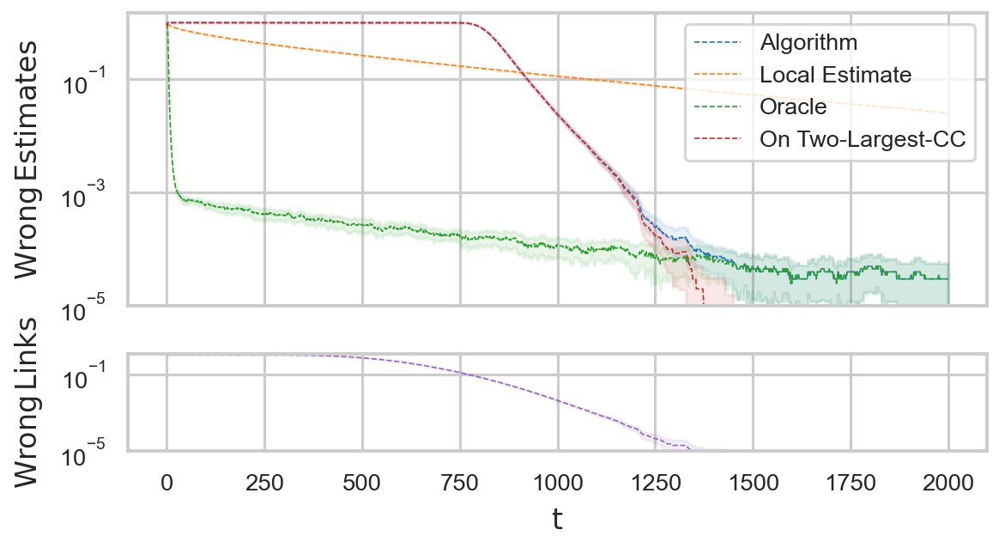
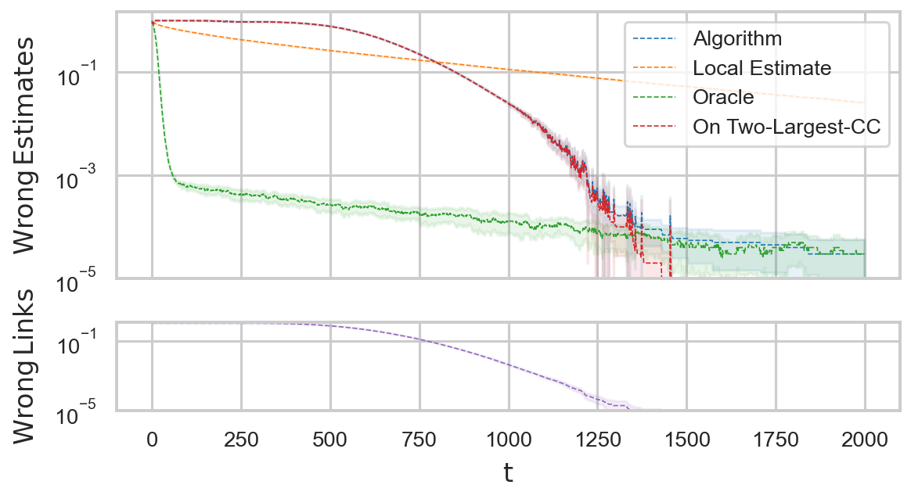
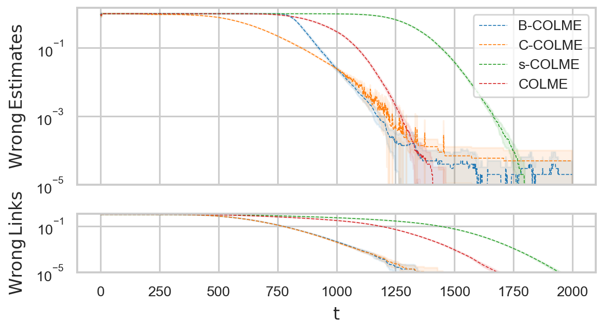
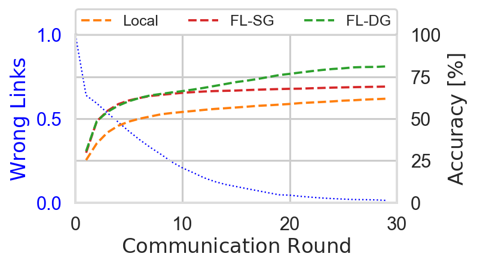

# Scalable ColME

#### Code for Galante, F., Neglia, G., & Leonardi, E. (2024). Scalable Decentralized Algorithms for Online Personalized Mean Estimation. https://arxiv.org/abs/2402.12812 - Accepted at AAAI Conference 2025

Our work introduces a scalable framework in which agents self-organize into a graph and collaboratively estimate their means using either a consensus-based (C-ColME) or a message-passing algorithm (B-ColME).

## Table of Contents

- [Abstract](#abstract)
- [Overview](#overview)
- [Installation](#installation)
- [Usage](#usage)
- [Results](#results)

## Abstract

In numerous settings, agents lack sufficient data to learn a model directly. Collaborating with other agents may help, but introduces a bias-variance trade-off when local data distributions differ.
A key challenge is for each agent to identify clients with similar distributions while learning the model, a problem that remains largely unresolved.
This study focuses on a particular instance of the overarching problem, where each agent collects samples from a real-valued distribution over time to estimate its mean. Existing algorithms face impractical per-agent space and time complexities (linear in the number of agents $|\mathcal{A}|$ ).
To address scalability challenges, we propose a framework where agents self-organize into a graph, allowing each agent to communicate with only a selected number of peers $r$. We propose two collaborative mean estimation algorithms: one employs a consensus-based approach, while the other uses a message-passing scheme, with complexity $\mathcal{O}(r)$ and $\mathcal{O}(r \cdot \log |\mathcal{A}|)$, respectively. 
We establish conditions for both algorithms to yield asymptotically optimal estimates and we provide a theoretical characterization of their performance.

## Overview

The repository contains the code for reproducing the experiments presented in the paper. Each folder includes detailed instructions on how to use the code.

- **colme_scalable_algorithms**: This folder contains the implementation of our **scalable algorithms**, B-ColME (message-passing) and C-ColME (consensus), which is used to produce Figures 1 and 2, as well as additional figures presented in the Supplementary Material.

- **ML_experiment**: This folder contains the implementation of our decentralized Federated Learning over a dynamic graph (FL-DG) and the benchmarks, corresponding to Figure 3.

- **multidimensional_means**: This folder includes the implementation of the multidimensional discovery phase and evaluation as a function of $K$ (dimensions) over time, corresponding to Figure 4 (in the extended version).

## Installation

To get started with the project, make sure you have the following prerequisites:

- **C++ Compiler**: Requires C++17.
- **CMake**: Version 3.14 or higher is necessary.
- **Python**: The specific Python version and dependencies can be found in each subfolder, along with the corresponding `requirements.txt` file.

## Usage

For detailed installation instructions, please refer to the README files within each subfolder.

## Results

The main results focus on the performance of our scalable approaches. First, we evaluate them against a *local* and a *oracle* benchmark (Figures 1a and 1b). Second, we provide a comparison against two versions of the original ColME algorithm (Figure 2) [code in `scalable_algorithms`].

#### Figure 1: [Performance Evaluation of B-ColME (top) and C-ColME (bottom)]

  

  

#### Figure 2: [Algorithms Comparison]

  

Lastly, a proof-of-concept result regarding the applicability of the approach over a ML task (handwritten digits recognition over MNIST) is given in Figure 3 [code in `ML_experiment`].

#### Figure 3: [MNIST Learning Experiment]

  

